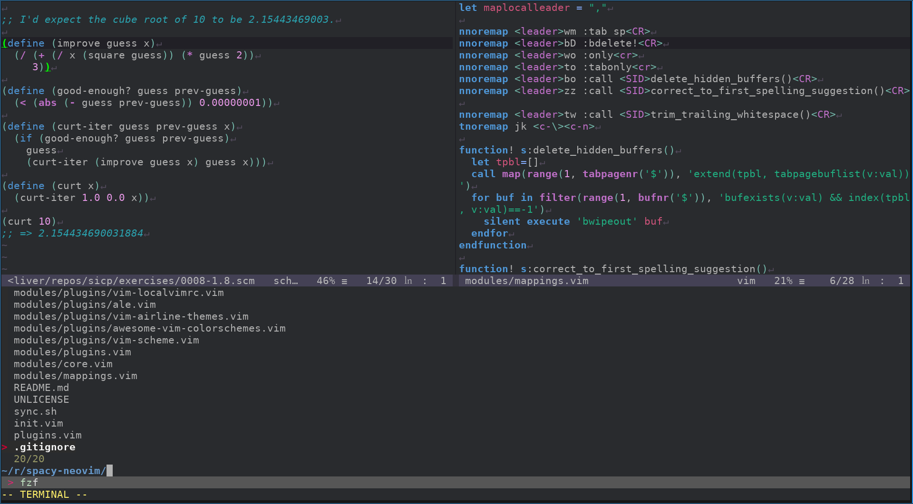

# spacy-neovim

A base [Neovim][] configuration template inspired by [Spacemacs][].

Please fork and modify the repository to suit your needs, you can build your own Neovim on top of this (subjectively) cool starting point.



## Who's it for?

If you're currently using Spacemacs for [Clojure][] (or any other language, Clojure is just my favourite) and you feel like trying out Neovim, you may feel overwhelmed and alienated at first. You don't know where to start building your own Neovim configuration.

How do you structure it? What plugin manager do you use? What's airline? Who's tpope and why are they so great?

These are the questions the intended audience will probably be asking themselves.

## What do you get?

 * [Really useful plugins](https://github.com/Olical/spacy-neovim/blob/master/plugins.vim)
 * [Linting](https://github.com/Olical/spacy-neovim/blob/master/modules/plugins/ale.vim)
 * [Autocompletion](https://github.com/Olical/spacy-neovim/blob/master/modules/plugins/deoplete.nvim.vim)
 * [Fuzzy matching of almost everything](https://github.com/Olical/spacy-neovim/blob/master/modules/plugins/fzf.vim) (just like helm)
 * [Clojure tooling](https://github.com/Olical/spacy-neovim/blob/master/modules/plugins/vim-fireplace.vim)
 * [Scheme tooling](https://github.com/Olical/spacy-neovim/blob/master/modules/plugins/vim-scheme.vim)
 * [Useful mappings](https://github.com/Olical/spacy-neovim/blob/master/modules/mappings.vim)
 * [Git integration](https://github.com/Olical/spacy-neovim/blob/master/modules/plugins/vim-fugitive.vim)
 * [Undo tree visualisation](https://github.com/Olical/spacy-neovim/blob/master/modules/plugins/vim-mundo.vim)
 * [Effortlessly jump around your code](https://github.com/Olical/spacy-neovim/blob/master/modules/plugins/vim-easymotion.vim)

Follow the links to the relevant source to see what I've bound these features to by default. Obviously you can change them to whatever works for you.

## How do I get it?

 1. Clone your fork of this repository into `~/.config/nvim/`
 2. Execute `~/.config/nvim/sync.sh`
 3. ???
 4. Execute `nvim`
 5. Profit!

You'll want to run `sync.sh` whenever you change your `plugins.vim` list or if you just want to update all of your current plugins.

[ripgrep][] and [fzf][] are used for findings things extremely quickly so make sure you have those installed. You'll probably want to configure fzf to use ripgrep too, I use these lines in my [fish][] config.

```fish
set -gx FZF_DEFAULT_COMMAND "rg --files --hidden --follow -g \"!.git/\" 2> /dev/null"
set -gx FZF_CTRL_T_COMMAND $FZF_DEFAULT_COMMAND
```

## Plugins?

Plugin management is provided by the wonderful [vim-plug][]. I've set things up so all you need to do is regularly run `sync.sh` to keep things up to date and alter `plugins.vim` to add or remove plugins.

Configuration for your plugins should go under `modules/plugins/NAME.vim` where `NAME` is the exact repo name of the plugin. If you remove a plugin from `plugins.vim` but forget to remove the appropriate config file my script will warn you.

## Who's this from?

I'm a long time Vim user, JavaScript escapee, Clojure admirer and keyboard builder. I've been using Spacemacs for quite a while now but fancied playing with Vim again, so I thought I'd put what I feel is a good starting point up here for others to build upon.

Here's a little more of me around the internet for further context:

 * https://oli.me.uk/
 * https://twitter.com/OliverCaldwell
 * https://github.com/Olical

Feel free to throw opinions about languages and text editors at me or help refine this little project into something small yet powerful.

## Unlicenced

Find the full [unlicense][] in the `UNLICENSE` file, but here's a snippet.

>This is free and unencumbered software released into the public domain.
>
>Anyone is free to copy, modify, publish, use, compile, sell, or distribute this software, either in source code form or as a compiled binary, for any purpose, commercial or non-commercial, and by any means.

Do what you want. Learn as much as you can. Unlicense more software.

[unlicense]: http://unlicense.org/
[neovim]: https://neovim.io/
[spacemacs]: http://spacemacs.org/
[clojure]: https://clojure.org/
[vim-plug]: https://github.com/junegunn/vim-plug
[fzf]: https://github.com/junegunn/fzf
[ripgrep]: https://github.com/BurntSushi/ripgrep
[fish]: https://fishshell.com
